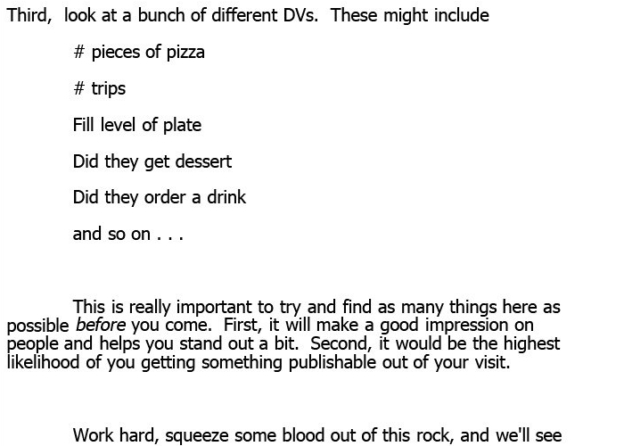

# <small>Who am I?</small>

----

My name is Matthias Weiler

----

I am a psychologist

----

I am a psychotherapist

----

I work as a research assistant  at Freie Universität Berlin

----

I am a nerd

----

I like free software

----

I like open science

# <small>And who are you?</small>

----

Please raise your hand ...

----

... if you study psychology

----

... if you want to become a psychotherapist

----

... if you want to become a scientist

----

... if you have participated in  a (small) research project

----

... if you know what open science is

----

... if you are (a little) anxious  to speak English in class

# <small>What are we going to do here?</small>

----

In the course of this semester you will...

----

... learn what open science is

----

... get to know tools that help  you with your research

----

... plan and conduct a small research project

----

... present your results to others

# <small>Any questions so far?</small>

# <small>Today: Why would I care for open science?</small>

# <small>Science - how does it work?</small>

----

The hypothetico-deductive model (Munafo et al. 2017)  
  
<small>Source (edited): https://media.nature.com/lw926/nature-assets/nathumbehav/2017/s41562-016-0021/images_hires/s41562-016-0021-f1.jpg</small>

----

What could possibly go wrong?

# <small>Quiz</small>

----

Which of the following articles  was actually published?

----

*A) Chocolate causes weight loss*  
or  
*B) Chocolate does not help you lose weight*

----

## <small>And the winner is ...</small>

<a href="https://de.scribd.com/doc/266969860/Chocolate-causes-weight-loss">*A) Chocolate causes weight loss*</a>

----

<a href="https://io9.gizmodo.com/i-fooled-millions-into-thinking-chocolate-helps-weight-1707251800">... except it doesn't</a>

# <small>Question</small>

----

Why did it get published anyway?

----

## <small>Answer</small>

Because positive and novel studies are  
more likely to be published whereas  
negative studies and replications usually 
remain inside the scientists’ drawers

----

This is known as *publication bias*

----

*There is no cost to getting things wrong*  
*The cost is not getting them published*  
  
Prof. Brian Nosek

# <small>Feeling the future</small>

----

## <small>Please raise your hand...</small>
... if you believe that your  
current thoughts and feelings  
are influenced by future events

----

*Feeling the future: Experimental evidence  *
*for anomalous retroactive influences on  *
*cognition and affect* (Bem, 2011)

----

Precognition conflicts with what we  
know to be true about the world  

----

Still, researchers failing to reproduce Bem's  
findings had substantial problems getting  
their negative results published

----

Rather ironically, some of Bem's findings  
are the result of HARKing, which stands for  
"Hypothesizing After the Results are Known"

# <small>Exercises</small>

----

Please pair up with the  
person sitting next to you

----

## <small>Exercise 1</small>

----

Person 1: Please think of a  
number between 1 and 100

----

Person 2: Guess person 1's number

----

Person 1: Please tell person 2  
the number you thought of

----

Who of you made the right guess?

----

## <small>Exercise 2</small>

----

Person 1: Please think of a  
number between 1 and 100

----

Person 1: Please tell person 2  
the number you thought of

----

Person 2: Guess person 1's number

----

Who of you made the right guess?

----

This is how HARKing works

----

Except, instead of guessing a number you  
would try to answer a research question

# <small>The pizza papers</small>

----

## <small>Scientists have a need for significance</small>

  
<small><a href = "https://imgs.xkcd.com/comics/p_values.png">"P-Values"</a> by <a href = "xkcd.com">xkcd.com</a> is licensed under <a href = "https://creativecommons.org/licenses/by-nc/2.5/">CC BY-NC 2.5</a></small>

----

  
<small>Source: https://img.buzzfeed.com/buzzfeed-static/static/2018-02/22/17/asset/buzzfeed-prod-fastlane-02/sub-buzz-5910-1519337798-6.jpg</small>

----

  
<small>Source: https://img.buzzfeed.com/buzzfeed-static/static/2018-02/22/17/asset/buzzfeed-prod-fastlane-02/sub-buzz-5910-1519337798-6.jpg</small>

----

  
<small>Source: https://img.buzzfeed.com/buzzfeed-static/static/2018-02/22/17/asset/buzzfeed-prod-fastlane-02/sub-buzz-5910-1519337798-6.jpg</small>

----

The process described here is known  
as *p-hacking* or <a href = "https://en.wikipedia.org/wiki/Data_dredging">*data dredging* </a>which  is the art of getting significant results

----

Visit <a href = "http://shinyapps.org/apps/p-hacker/">p-hacker </a>and train your  
p-hacking skills today!

# <small>Power up</small>

----

What if there is an effect  
and you just can't find it?

----

## <small>Power posing</small>

.jpg) 

<small>Source: Erik (HASH) Hersman from Orlando [<a href="https://creativecommons.org/licenses/by/2.0">CC BY 2.0</a>], <a href="https://commons.wikimedia.org/wiki/File:Power_pose_by_Amy_Cuddy_at_PopTech_2011_(6279920726).jpg">via Wikimedia Commons</a></small>

----

## <small>Statistical power in a nutshell</small>

- $\alpha$: The conditional probability of incorrectly  
  rejecting H0 when it actually is true.
- $\beta$: The conditional probability of failing  
  to reject H0 when it is false.
- Power: The complement of β (i.e. 1 - β), this is the  
  probability of correctly rejecting H0 when it is false.
  
----

<a href="http://rpsychologist.com/d3/NHST/">Understanding Statistical Power  
  and Significance Testing</a>

----

## <small>Better science with quality control</small>

- <a href = "http://andrewgelman.com/2015/04/28/whats-important-thing-statistics-thats-not-textbooks/">"Bad things happen when we don’t  think seriously about measurement"</a>
- Sloppy measurement often leads  to "noisy data"
- Noisy data leads to low statistical power

# <small>Summary</small>

----

The hypothetico-deductive model (Munafo et al. 2017)  
  
<small>Source (edited): https://media.nature.com/lw926/nature-assets/nathumbehav/2017/s41562-016-0021/images_hires/s41562-016-0021-f1.jpg</small>

----

The hypothetico-deductive model (Munafo et al. 2017)  
  
<small>Source (edited): https://media.nature.com/lw926/nature-assets/nathumbehav/2017/s41562-016-0021/images_hires/s41562-016-0021-f1.jpg</small>

# <small>Any more questions?</small>

# <small>Next session preview</small>

----

Open science to the rescue

# Thank you for your attention
